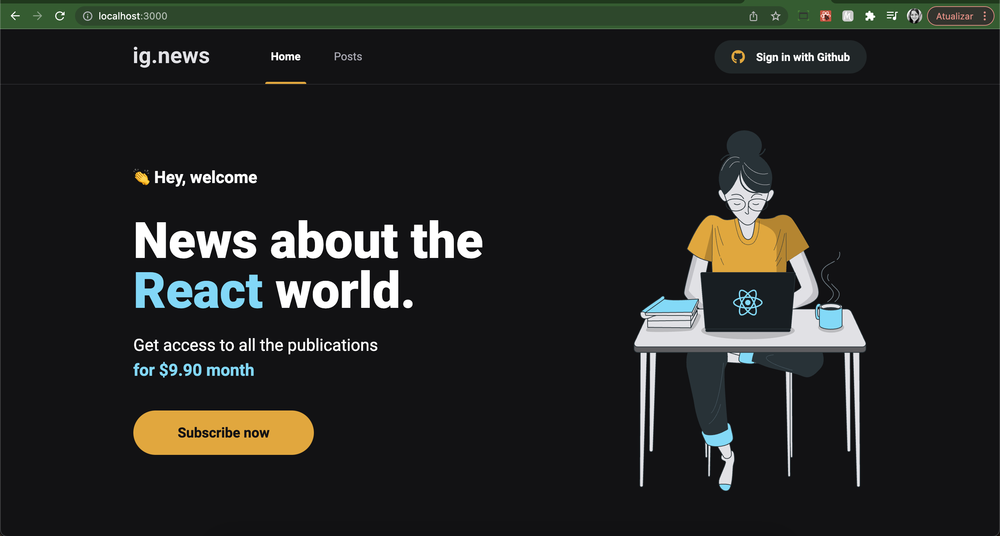
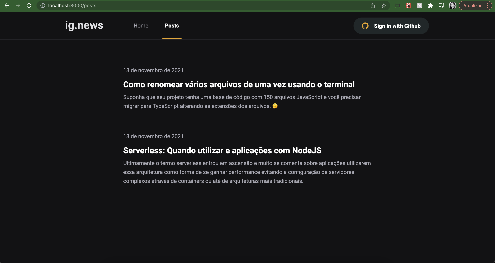
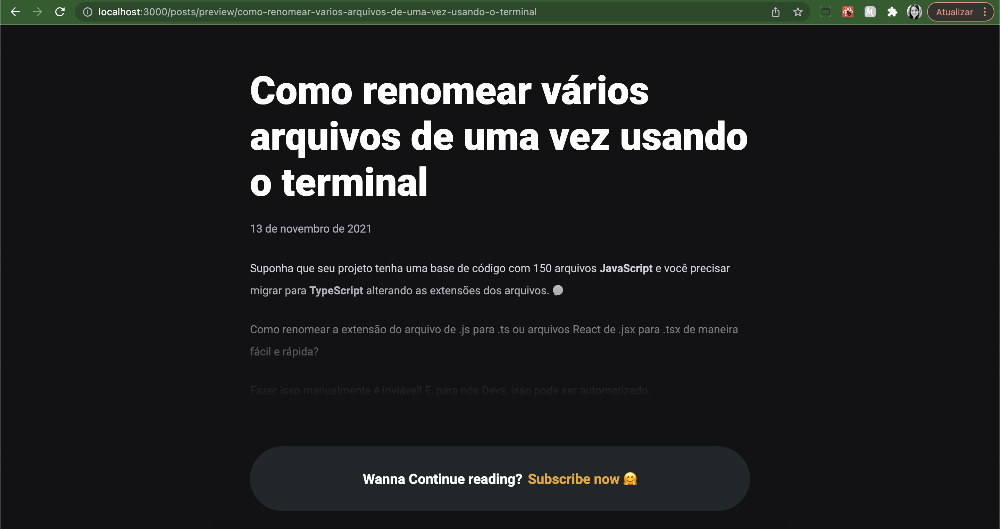

## 🧪 Tecnologias

Esse projeto foi desenvolvido com as seguintes tecnologias:

- [NextJs](https://nextjs.org/)
- [Fauna](https://fauna.com/)
- [Stripe](https://stripe.com/)

## 🧪 Telas

Home:

<h1 align="center">
    
</h1>
Lista com os posts cadastrados no Fauna:
<br>
<h1 align="center">
    
</h1>
Preview do conteúdo do post quando o usuário não está logado:
<br>
<br>
<h1 align="center">
    
</h1>

## 🚀 Como executar

Clone o projeto e acesse a pasta do mesmo.

```bash
$ git clone https://github.com/mariliamessias/ignite-ignews/
$ cd ignite-ignews
```

Para iniciá-lo, siga os passos abaixo:
```bash
# Instalar as dependências
$ yarn

# Iniciar o projeto
$ yarn start
```
O app estará disponível no seu browser pelo endereço http://localhost:3000.

## 💻 Projeto

Projeto do curso Ignite da Rocketseat que tem como objetivo introduzir conhecimentos no Framework NextJs,
usando Fauna para gerenciar os posts e Stripe para simular o pagamento com cartão de crédito. Além disso, implementamos SASS na aplicação e Login com o Github.

## 📝 License

Esse projeto está sob a licença MIT. Veja o arquivo [LICENSE](LICENSE.md) para mais detalhes.
